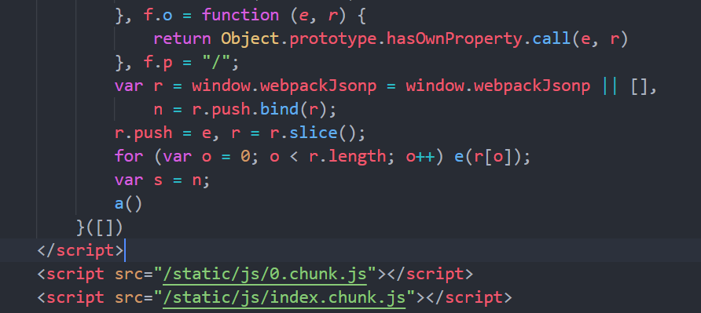
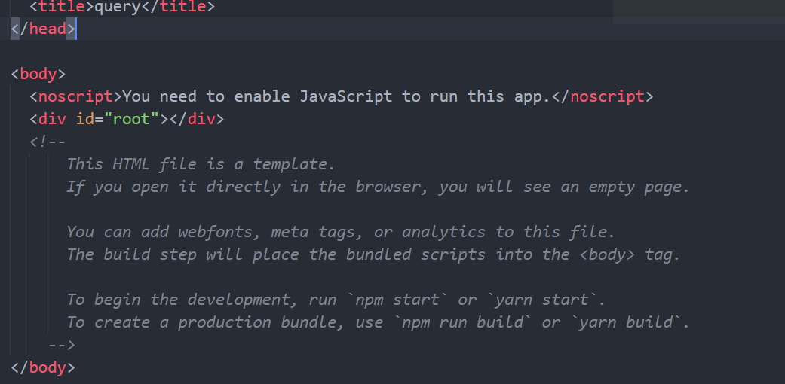

# create-react-app创建的多页应用打包的js代码没有插入到html中

我是使用 create-react-app 构建的多页应用，通过运行 npm run eject 让配置文件暴露出来，然后修改了配置文件的一些内容。结果，第一个页面是可以显示的，而通过跳转第别的页面，是没有内容的。  
我先是修改了 paths.js 中的路径，添加了几条 html 和 js 路径（其他的都没改）：
```js
{
    appHtml: resolveApp('public/index.html'),
    appQueryHtml: resolveApp('public/query.html'),
    appTicketHtml: resolveApp('public/ticket.html'),
    appOrderHtml: resolveApp('public/order.html'),

    appIndexJs: resolveModule(resolveApp, 'src/index/index'),
    appQueryJs: resolveModule(resolveApp, 'src/query/index'),
    appTicketJs: resolveModule(resolveApp, 'src/ticket/index'),
    appOrderJs: resolveModule(resolveApp, 'src/order/index'),
}
```
然后修改了 webpack.config.js 中的内容。  
首先是修改了 output 中的导出文件，让导出多个文件（其他的没改）：
```js
{
    output: {
        filename: isEnvProduction
        ? 'static/js/[name].[contenthash:8].js'
        : isEnvDevelopment && 'static/js/[name].bundle.js',
      // TODO: remove this when upgrading to webpack 5
      futureEmitAssets: true,
      // There are also additional JS chunk files if you use code splitting.
      chunkFilename: isEnvProduction
        ? 'static/js/[name].[contenthash:8].chunk.js'
        : isEnvDevelopment && 'static/js/[name].chunk.js',
    }
}
```
然后修改 entry ：
```js
{
    entry: {
      ticket: [
        paths.appTicketJs, isEnvDevelopment && require.resolve('react-dev-utils/webpackHotDevClient')
      ].filter(Boolean),
      order: [
        paths.appOrderJs, isEnvDevelopment && require.resolve('react-dev-utils/webpackHotDevClient')
      ].filter(Boolean),
      query: [
        paths.appQueryJs, isEnvDevelopment && require.resolve('react-dev-utils/webpackHotDevClient')
      ].filter(Boolean),
      index: [
        paths.appIndexJs, isEnvDevelopment && require.resolve('react-dev-utils/webpackHotDevClient')
      ].filter(Boolean),
    }
}
```
最后修改了 html-webpack-plugin 中的内容，更换了 template、chunks 和 filename的值。
```js
[
    new HtmlWebpackPlugin(
        Object.assign({}, {
            inject: true,
            template: paths.appTicketHtml,
            fileName: 'ticket.html',
            chunks: ['ticket']
          },
          isEnvProduction ? {
            minify: {
              removeComments: true,
              collapseWhitespace: true,
              removeRedundantAttributes: true,
              useShortDoctype: true,
              removeEmptyAttributes: true,
              removeStyleLinkTypeAttributes: true,
              keepClosingSlash: true,
              minifyJS: true,
              minifyCSS: true,
              minifyURLs: true,
            },
          } :
          undefined
        )
      ),

      new HtmlWebpackPlugin(
        Object.assign({}, {
            inject: true,
            template: paths.appOrderHtml,
            fileName: 'order.html',
            chunks: ['order']
          },
          isEnvProduction ? {
            minify: {
              removeComments: true,
              collapseWhitespace: true,
              removeRedundantAttributes: true,
              useShortDoctype: true,
              removeEmptyAttributes: true,
              removeStyleLinkTypeAttributes: true,
              keepClosingSlash: true,
              minifyJS: true,
              minifyCSS: true,
              minifyURLs: true,
            },
          } :
          undefined
        )
      ),

      new HtmlWebpackPlugin(
        Object.assign({}, {
            inject: true,
            template: paths.appQueryHtml,
            fileName: 'query.html',
            chunks: ['query']
          },
          isEnvProduction ? {
            minify: {
              removeComments: true,
              collapseWhitespace: true,
              removeRedundantAttributes: true,
              useShortDoctype: true,
              removeEmptyAttributes: true,
              removeStyleLinkTypeAttributes: true,
              keepClosingSlash: true,
              minifyJS: true,
              minifyCSS: true,
              minifyURLs: true,
            },
          } :
          undefined
        )
      ),

      new HtmlWebpackPlugin(
        Object.assign({}, {
            inject: true,
            template: paths.appHtml,
            fileName: 'index.html',
            chunks: ['index']
          },
          isEnvProduction ? {
            minify: {
              removeComments: true,
              collapseWhitespace: true,
              removeRedundantAttributes: true,
              useShortDoctype: true,
              removeEmptyAttributes: true,
              removeStyleLinkTypeAttributes: true,
              keepClosingSlash: true,
              minifyJS: true,
              minifyCSS: true,
              minifyURLs: true,
            },
          } :
          undefined
        )
    ),
]
```
其它就没了，之后运行 npm start，看到了 index.html 页面，内容也能展示，但是在这个页面跳转到别的页面后，别的页面是空白的。我做了一个实验，发现哪个HTML在数组的最后一个，那么运行 `npm start` 时显示的就是哪个页面。  
跳转之后的那个页面没有插入js代码。下面是通过 npm build 生成的 html 文件：  

放在最后的 index 页面是有的


而其它页面跟 query 页面一样，跟之前的 html 模板一样
  

在这之前，也在网上找过相关回答，结果还是不行。比如有的说更改 devServer 配置项的 `historyApiFallback` 内容，添加 `rewrites` 属性，结果也不行。  

npm start 运行的控制台输出跟运行成功的输出是一样的。npm build 的输出也只是提醒安装 `caniuse-lite browserslist` :
```
Browserslist: caniuse-lite is outdated. Please run next command `yarn upgrade caniuse-lite browserslist
```
不知道还应该怎么进行配置才能让页面展示出来。