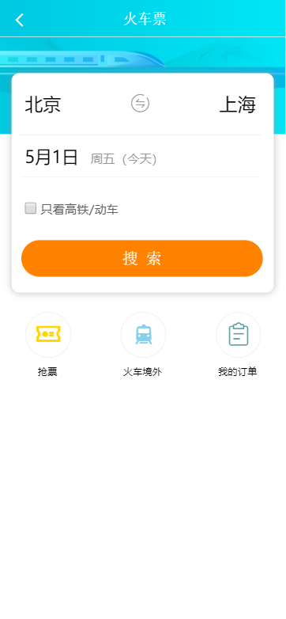
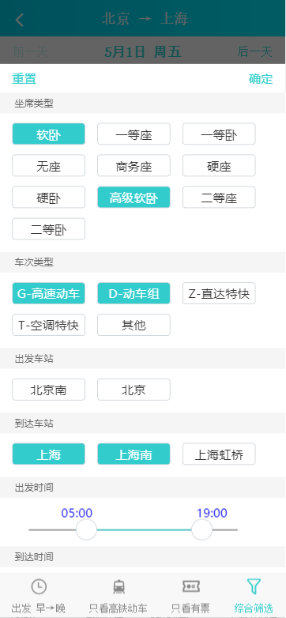
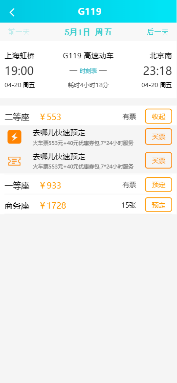
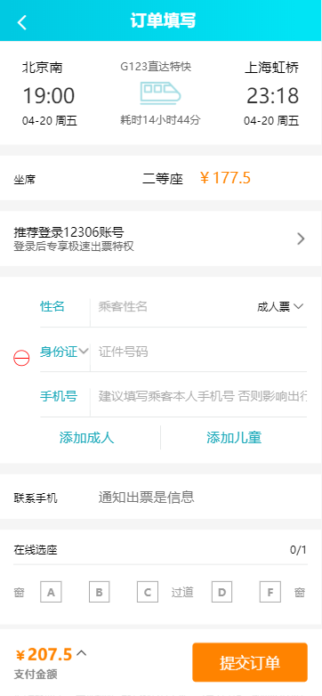

# React 实现去哪儿移动端火车票功能页  

使用 React + Redux 构建的去哪儿移动端火车票页面。  

    
   

一共四个页面，页面里还有一些小的页面，例如日历组件、城市列表、筛选模态框。这个项目还是很复杂的，中间一度想要放弃，最终还是坚持做了下来，组件实现是用的 React Hook，并没有使用类组件。而有些功能并没有实现，购买火车票与后端交互性很强，会频繁的发起网络请求，而且请求参数众多，在实现过程中异步请求（尤其是火车票查询页面）都是使用网络爬虫从去哪儿官方 API 获取的，因为个人实力原因，有些数据并没有请求到数据，也就渲染不到页面上。比如查询页面，Ajax 请求只能请求到今天的车次信息，不过影响不算太大，页面基本逻辑还是有的。  

## 项目搭建

使用 `create-react-app` 搭建的项目。因为有四个页面，而 create-react-app 默认支持的是单页应用，我需要重新配置一下 webpak。  

我是使用 `npm run eject` 让配置文件暴露出来，然后做修改的。可以参考这个文档：  

[改造 create-react-app 配置](qunaerwang_project/01.md)  

因为用到后端给前端提供接口，就需要使用代理，而 create-react-app 内部已经集成，只需要在 package.json 文件中设置代理服务器的地址即可：  

```json
{
    "proxy": "http://localhost:5000"
}
```

后端使用的 Express，就是简单的用了用。  

状态管理库使用的是 redux，每个页面都有一个 store 对数据进行管理。经过实践发现，一个数据交由一个 reducer 处理，这样会让代码看起来更整洁。  

项目源码都在 /qunaerwang_project/src 目录下。

### 运行这个程序

需要打开两个终端，分别进入到 `qunaerwang_project` 和 `qvnaerwang_server` 目录中，都运行 `npm run start`，就可以启动程序了。  

或者进入 qunaerwang_project 目录，运行 `npm run build`，对项目打包，然后启动代理服务器。 

